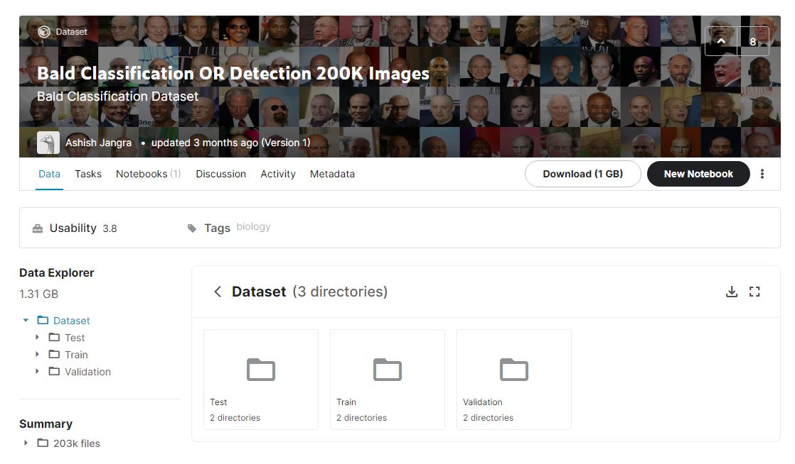

# Bald or Not Classification


## 下载数据集

本项目使用的数据集是来自Kaggle网站上[Ashish Jangra](https://www.kaggle.com/ashishjangra27)提供的Bald Classification Dataset数据集，下载地址如下：



https://www.kaggle.com/ashishjangra27/bald-classification-200k-images-celeba

下载之后将文件夹的名称改为`bald`，放到项目中的`data`文件夹下。（`bald`下的`Test`，`Train`，`Validation`文件夹的位置和名称不做修改）


## 下载预训练权重

下载预训练权重，并将其放在文件夹 `model_data`下，配置文件中默认的权重文件名与下载的权重文件名一致，默认可以不做修改:

```shell
resnet18: https://download.pytorch.org/models/resnet18-5c106cde.pth
resnet34: https://download.pytorch.org/models/resnet34-333f7ec4.pth
resnet50: https://download.pytorch.org/models/resnet50-19c8e357.pth
resnet101: https://download.pytorch.org/models/resnet101-5d3b4d8f.pth
resnet152: https://download.pytorch.org/models/resnet152-b121ed2d.pth
resnext50_32x4d: https://download.pytorch.org/models/resnext50_32x4d-7cdf4587.pth
resnext101_32x8d: https://download.pytorch.org/models/resnext101_32x8d-8ba56ff5.pth
wide_resnet50_2: https://download.pytorch.org/models/wide_resnet50_2-95faca4d.pth
wide_resnet101_2: https://download.pytorch.org/models/wide_resnet101_2-32ee1156.pth
```

默认使用的是ResNet-18作为主干网络


## 安装conda环境

```shell
conda create -n your_env_name python=3.7
```

```shell
conda install --yes --file requirements.txt
```

```shell
conda activate your_env_name
```


## 修改网络参数

在配置文件`config.py`下修改对应训练参数

```python
self._configs['nums_of_classes'] = 2
self._configs['device_ids'] = [0]
self._configs['freeze'] = True
self._configs['unfreeze'] = True
self._configs['freeze_epoch'] = 50
self._configs['unfreeze_epoch'] = 50
```

- `nums_of_classes` 表示分类的类别数量
- `device_ids` 表示`GPU`的块数索引，设置可见的`GPU`块数在`train.py`文件中
- freeze 表示在使用`resnet18`时进行迁移学习，只解冻最后的全连接层，其他层锁住。实验表明，这种预训练能达到比较好的效果，默认预训练次数为50次


## 训练

设置可用的`GPU`数量

```python
os.environ["CUDA_VISIBLE_DEVICES"] = "0, 1, 2, 3"
```

```python
python train.py
```

生成的权重文件在`checkpoint`文件夹下，同时在`log`文件夹下存放的是训练日志信息。


## 测试

```python
python inference.py
```

测试结果会在`output`文件夹下生成`results.csv`文件。


## 说明

1. 没有`GPU`的电脑，可以使用`CPU`训练，无需更改`GPU`的任何配置，即可训练。
2. 数据集中的秃头图片数量小于不秃头的数量，为了减少训练样本数量不匹配的问题，可以对数据集进行适当的选取。
3. 使用的`Early Stopping`和`Reduce Lr`机制自动减少过拟合的发生。
4. 配置文件中默认将每个`epoch`的训练结果进行保存，你也可以在配置文件中进行更改。`checkpoints`文件夹下除了会有每次的训练结果之外，还会优选出当前最佳的权重文件`resnet18_final_checkpoint.pth`，可以将这个权重作为测试使用。
5. 后续过程中，将对预测结果进行可视化的展示。

